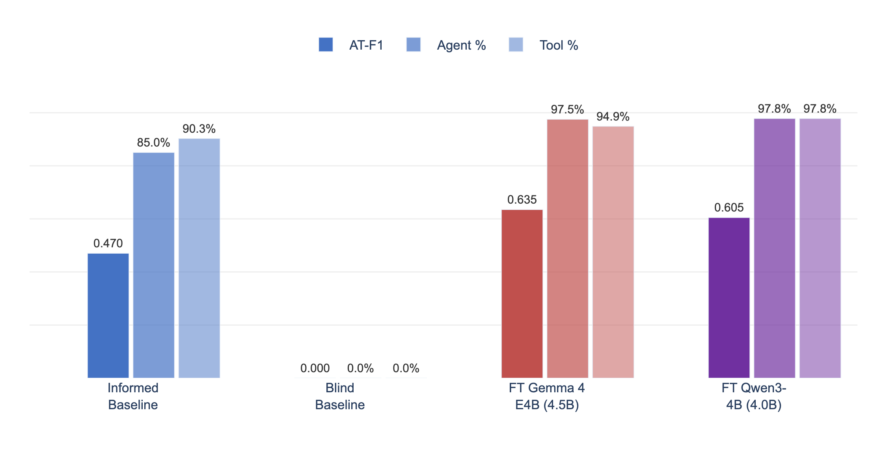

# Description-Free Tool Planning for Fixed Catalogs via QLoRA Fine-Tuning

MCP-based LLM agents include full tool schemas in every prompt, creating ~2,400 tokens of overhead per query. Small models (~4B parameters) cannot plan without these descriptions, forcing reliance on expensive frontier models. We fine-tune small models to internalize a fixed tool catalog, enabling structured planning **without any tool descriptions at inference time** — reducing prompt length by 94.7% while improving planning quality.

## Key Result

Fine-tuned ~4B models operating **without any tool descriptions** outperform the unfine-tuned baseline that receives full tool schemas:



| Configuration | AT-F1 | Judge Score (1-5) | Prompt Tokens |
|---|---|---|---|
| Description-free baseline (no FT) | 0.000 | 1.88 | ~128 |
| Informed baseline (no FT, full schemas) | 0.470 | 2.88 | ~2,400 |
| **Gemma 4 E4B fine-tuned (no schemas)** | **0.635** | **3.60** | **~128** |
| **Qwen3-4B fine-tuned (no schemas)** | **0.605** | **3.78** | **~128** |

A LoRA rank sweep shows the best Gemma configuration (r=32) reaches a judge score of **3.88** and AT-F1 of **0.65**.

---

## Setup

```bash
# 1. Install dependencies
uv sync

# 2. Configure environment
cp .env.public .env
# Edit .env: add GEMINI_API_KEY (required)

# 3. Start CouchDB (required for IoTAgent tools)
docker compose -f src/couchdb/docker-compose.yaml up -d

# 4. Run a single query (informed mode)
uv run plan-execute --model-id "gemini/gemma-4-26b-a4b-it" --show-plan "What IoT sites are available?"

# 5. Evaluate plan quality (structural, free)
uv run python benchmark/baseline_tests/evaluate_plan_quality.py \
    --candidate benchmark/baseline_tests/gemini_flash_informed_results.json \
    --mode structural
```

## Reproducing Fine-Tuning Results

The fine-tuning experiments run on a single A100 80GB GPU. See the notebooks in `notebook/`:
- `Planner_Internalization_Experiment.ipynb` — primary experiment
- `*_run_2` through `*_run_6` — sequential ablation runs (rank sweep, data ablation, retention analysis, Qwen3)

---

## Methodology

### Benchmark

[AssetOpsBench](https://huggingface.co/datasets/ibm-research/AssetOpsBench) — 152 natural-language scenarios for industrial asset operations, requiring multi-step tool-use planning across 5 MCP server families and 23 tools.

### Models

| Model | Total Params | Active Params | Architecture |
|---|---|---|---|
| Gemma 4 E4B-it | ~8B | 4.5B | Hybrid attention (36 sliding + 6 global) |
| Qwen3-4B | 4.0B | 3.6B | GQA (32Q / 8KV) |

### Training

- **Method:** QLoRA (8-bit quantization, LoRA rank 32, alpha=64)
- **Data:** ~1,741 examples (tool knowledge + planning scenarios)
- **Hardware:** Single NVIDIA A100 80GB
- **Cost:** ~$62 GPU compute (15.8 A100-hours)
- **Training time:** 56 min (Gemma), 40 min (Qwen3)

### Evaluation

- **Structural metrics:** AT-F1 (agent-tool pair F1), ArgKey-F1
- **LLM-as-judge:** Gemini 2.5 Flash rates plans on 6 dimensions (1-5 scale)
- **Capability retention:** 100 MCQ questions from MMLU, ARC-Challenge, HellaSwag

---

## Results Summary

### Tool Internalization
Fine-tuned models produce correct plans without tool descriptions, achieving 95-98% server/tool accuracy and surpassing the informed baseline on all metrics.

### LoRA Rank Trade-off
| Rank | Judge Score | MCQ Retention |
|---|---|---|
| r=8 | 3.77 | 82.1% |
| r=16 | 3.81 | — |
| r=32 | 3.88 | 79.8% |
| r=64 | 3.83 | — |

Higher rank improves planning quality but reduces general capability retention.

### Deployment (A100 80GB)

| Metric | Gemma 4 E4B | Qwen3-4B |
|---|---|---|
| Base memory (8-bit) | 11.5 GB | 4.42 GB |
| Peak training memory | 24.1 GB | 16.06 GB |
| Inference speed | 1.4 tok/s | 3.49 tok/s |

---

## Repository Structure

```
├── src/
│   ├── llm/                    # LLM backend (litellm routing)
│   ├── workflow/               # Plan-execute pipeline (planner, executor, runner, CLI)
│   ├── servers/                # 4 MCP servers (iot, fmsr, tsfm, utilities)
│   └── couchdb/                # Docker compose for CouchDB
├── benchmark/
│   ├── baseline_tests/         # Eval scripts, gold plans, result JSONs
│   └── generate_data/          # SFT training data generation
│       └── datasets/           # Generated JSONL datasets
├── notebook/
│   ├── Planner_Internalization_Experiment*.ipynb  # Fine-tuning experiments
│   └── figures/                # Paper figures (PNG)
├── paper/
│   ├── main.tex                # Paper source (ACL format)
│   ├── custom.bib              # Bibliography
│   └── figures/                # Paper figures
├── requirements.txt
├── pyproject.toml
├── .env.public                 # Environment template
└── LICENSE                     # Apache-2.0
```

---

## Links

- [AssetOpsBench Paper](https://openreview.net/forum?id=ld6JUQbhes)
- [HuggingFace Dataset](https://huggingface.co/datasets/ibm-research/AssetOpsBench)
- [IBM AssetOpsBench Repo](https://github.com/IBM/AssetOpsBench)
- [Gemma 4 Docs](https://ai.google.dev/gemma/docs/core)
- [Qwen3 Blog](https://qwenlm.github.io/blog/qwen3/)
